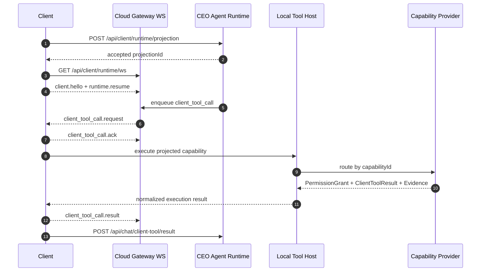

# 宙斯客户端 Runtime Gateway 调用生命周期

这份文档替代旧的本地 `tool:dispatch` / Adapter Server 设计。客户端不再作为本地
WebSocket server 等待 Node Service 连接；正式主链路统一为客户端主动连接云端
Gateway WS。

## 架构边界

| 层 | 职责 |
|---|---|
| 云端 CEO Agent Runtime | 认知、规划、工具选择、组织策略、执行账本 |
| Runtime Gateway WS | 向已登录客户端推送被 Runtime Projection 允许的 `client_tool_call` |
| 桌面客户端 Runtime Gateway Client | 主动 outbound 连接云端、ack、resume、回传 result |
| Local Tool Host | 统一接收被 projection 允许的本地调用，并交给 Capability Provider Registry |
| Capability Provider Registry | 按 capabilityId 路由到具体本地 Provider，禁止 Bash / MCP / Plugin 另起旁路 |
| PermissionReview | 本地授权、PermissionRule、用户确认和执行时约束的统一入口 |

云端不能直接访问本地端口。任何本地能力都必须经过：

```text
Capability Provider -> Manifest -> Runtime Projection -> client_tool_call -> PermissionGrant -> Evidence
```

## 主链路



## 事件契约

核心事件定义在 `packages/protocol/src/runtime-gateway.ts`：

- `client.hello`
- `runtime.resume`
- `runtime.heartbeat`
- `runtime.projection_published`
- `client_tool_call.request`
- `client_tool_call.ack`
- `client_tool_call.result`
- `runtime.error`

`client_tool_call.request` 必须携带：

- `sessionId`
- `projectionId`
- `seq`
- `conversationId`
- `call.toolCallId`
- `call.capabilityId`
- `call.arguments`

客户端收到后必须先做 projection guard：

1. `sessionId` 必须匹配当前客户端 session。
2. `projectionId` 必须匹配当前 accepted projection。
3. `capabilityId` 必须命中 projection 的 capability 列表。
4. disabled / policy disabled / untrusted capability 不执行。

## 本地执行

第一阶段 Local Tool Host 不直接写 capability 分支逻辑。它内部使用
`CapabilityProviderRegistry`，每个本地能力以 Provider adapter 接入：

| Provider | capabilityIds |
|---|---|
| `local.health` | `local.health` |
| `local.shell` | `local.shell.exec`, `local.shell.stop` |

新增 MCP、Plugin、File、App Automation 时，必须新增 Provider adapter 并注册到
Registry，不能修改 Local Tool Host 去堆 `capabilityId === ...` 分支。

`local.shell.exec` 默认不允许云端绕过本地授权。Shell Provider 会先做本地 command
classification，再交给 `PermissionReview` 读取
`<userData>/permissions/shell-rules.json`。read-only 命令可以自动执行；write /
network / process-control / unknown 默认进入 ask，没有本地授权 UI 或命中 rule 时拒绝；
destructive 默认拒绝。

`PermissionReview` 是写入 Shell PermissionRule 的唯一正式入口。`allow` rule 必须满足：

- match 只能是 `exact` 或足够具体的 `prefix`，不能使用 wildcard。
- 必须绑定 workspace 内的 `scope.cwd`。
- 必须声明 `scope.maxRiskLevel`，且不能覆盖 `L5_destructive`。
- renderer 不能直接写入 raw rule store。

Shell 输出必须写入本地 artifact，云端只拿 redacted preview 和
`local-shell-artifact://...` 引用。停止动作通过 `local.shell.stop` 或
`shell:tasks:stop-active` IPC 进入同一个 task manager，不能绕过 Gateway / Local Tool Host
之外另建执行通道。

Gateway 已经 ack 的调用必须有标准 `ClientToolResult`。如果 Provider 执行过程中抛错，
Runtime Gateway Client 必须包装成失败 result 并回传云端，不能只发送 `runtime.error`。

后台任务必须形成两段 result：

1. 启动后立即返回 `outputPreview.status = "running"`，包含 `backgroundTaskId`。
2. 任务完成、失败、超时或被停止后，由 Provider 通过 Gateway follow-up result 回传最终
   `success` / `failed` / `cancelled`，并携带 stdout/stderr preview、artifact refs 和
   `backgroundCompleted = true`。

云端执行账本以最终 result 为准；running result 只表示本地任务已被接受并启动。

## 断线恢复

客户端维护：

- `lastAckSeq`
- 已处理过的 `toolCallId`
- 本地 result retry queue

重连后客户端发送 `runtime.resume`，包含：

- 当前 `sessionId`
- 当前 `projectionId`
- `lastAckSeq`
- `pendingResultCount`

回传失败的 result 写入：

```text
<userData>/runtime-gateway/client-tool-results.json
```

下次 Gateway WS 连通后自动 flush。Evidence 在本地队列中保留
`returnedToCloud: false`，成功回传前不标记为云端已接收。

## 旧链路处理

旧本地 WS server、`tool:dispatch`、临时测试客户端和 Action Registry 已经退出正式
代码路径。后续 Plugin、MCP、Skill、Bash 都不能另起旁路协议，必须复用 Runtime
Gateway + Local Tool Host。
