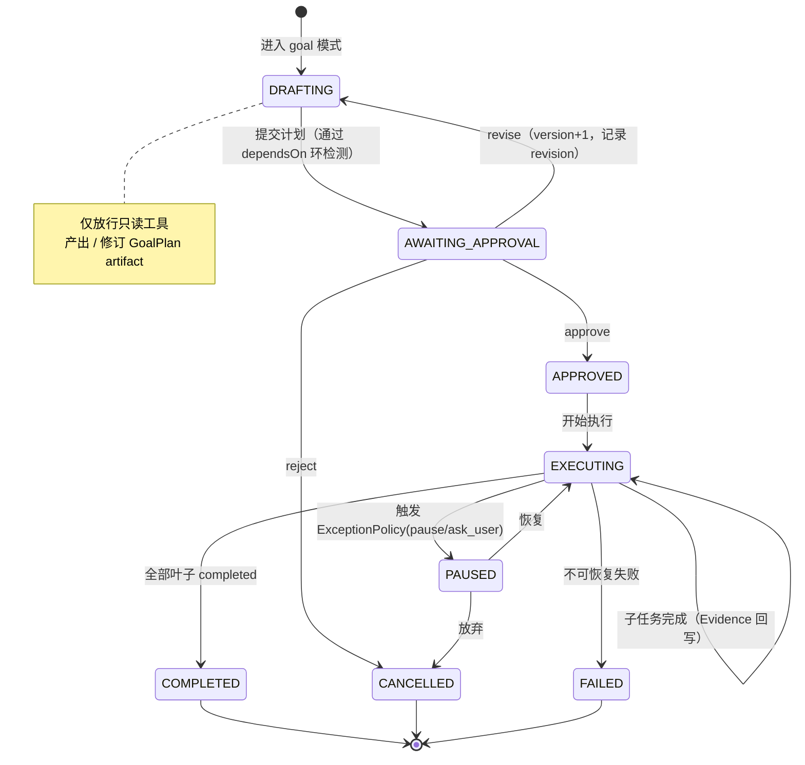
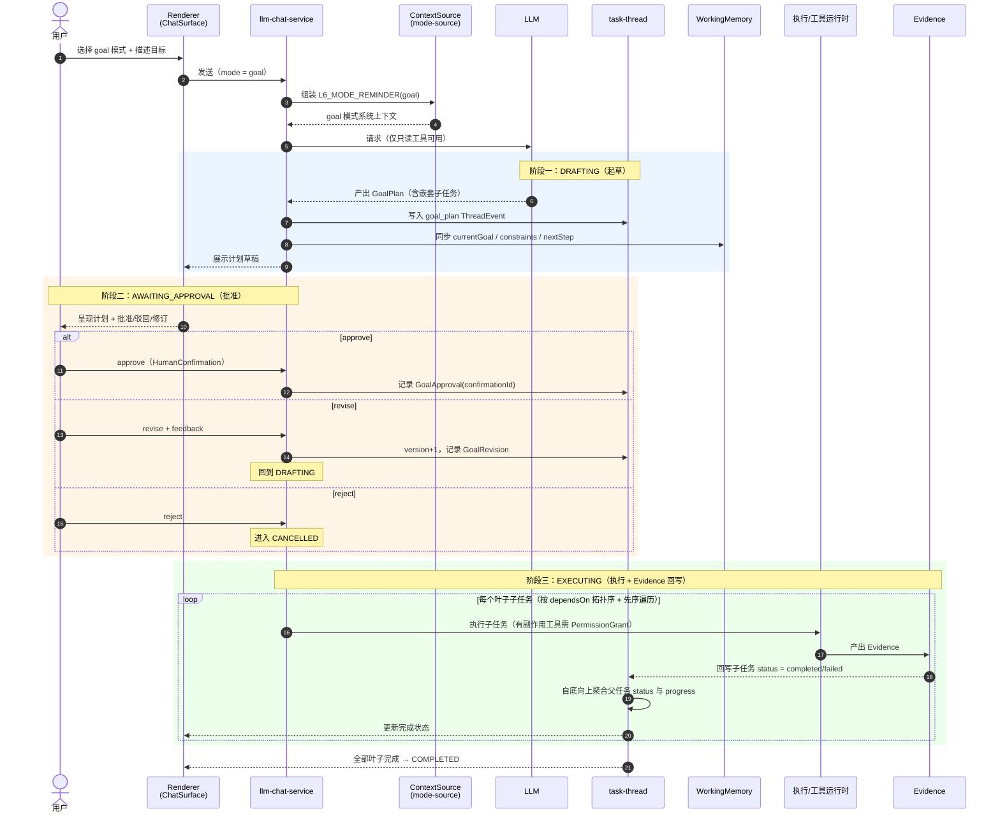

# Proposal 0002: Goal 模式（先规划后执行 + 可追踪计划 Artifact）

日期：2026-06-16
状态：提案 / 待评审
级别：A 级变更（涉及 System Context 顺序、能力暴露边界、计划产物的 Evidence 与持久化）

---

## 0. 摘要

新增一个对话模式 `goal`。该模式引导用户与 Agent **共同产出一份结构化、可持久化、可追踪的实现计划**，并采用「先规划 → 用户批准 → 执行」的流程。计划被拆分为可独立追踪完成状态的子任务（支持嵌套），每个子任务的「完成」只能由 Evidence 回写，不能由模型文本或渲染层 state 直接置位。

本提案最大限度复用仓库现有接缝，不发明新的存储层：

- 计划产物作为新的 `ThreadEvent` 进入 `packages/task-thread`。
- 子任务状态复用 `packages/protocol/src/execution.ts` 的 `ExecutionStatus`。
- 批准流程复用 `execution.ts` 的 `HumanConfirmation`（approve / reject / revise）。
- 跨轮次续传映射到 `packages/protocol/src/memory.ts` 的 `WorkingMemorySnapshotJson`。
- 模式文案通过 `mode-source.mjs` 进入 `L6_MODE_REMINDER` 层。

---

## 1. 目标与非目标

### 1.1 目标

- 新增 `goal` 模式，引导用户产出涵盖「目标 / 达成路径 / 完成状态 / 异常处理 / 边界条件 / 涉及文件」的实现计划。
- 流程为「先规划后执行」：DRAFTING → AWAITING_APPROVAL → EXECUTING。
- 计划是持久化的 Evidence/artifact，跨轮次可续传、可追溯版本。
- 每个子任务（含嵌套）独立追踪完成状态，状态以 Evidence 为准。
- 用户的批准 / 驳回 / 修订作为治理事实被记录。

### 1.2 非目标

- 不自动执行未经批准的有副作用工具。
- 不替代 task-thread / memory / Evidence / 权限链路的既有职责。
- 不在本提案内实现自动回滚的具体执行器（rollback 的 schema 先落地，执行器可后置）。

---

## 2. 状态机（先规划后执行）

```text
DRAFTING（起草）
  - 仅放行只读工具，禁止有副作用工具（与 compact 模式禁工具一致）
  - 产出 / 修订 GoalPlan artifact
  -> AWAITING_APPROVAL（待批准）
       - 复用 HumanConfirmation：approve / reject / revise
       -> approve  -> APPROVED -> EXECUTING
       -> revise   -> DRAFTING（version+1，记录 revision）
       -> reject   -> CANCELLED
  -> EXECUTING（执行）
       - 按子任务推进，每个子任务独立 ExecutionStatus
       - 子任务完成由 Evidence 回写
       - 触发 ExceptionPolicy 可进入 PAUSED
       -> PAUSED -> EXECUTING（恢复）/ CANCELLED
       -> 全部叶子完成 -> COMPLETED
       -> 不可恢复失败 -> FAILED
```

状态枚举：`drafting | awaiting_approval | approved | executing | paused | completed | cancelled | failed`。

---

## 2.1 流程图

### 2.1.1 状态流转图



### 2.1.2 端到端时序图（规划 → 批准 → 执行 → Evidence 回写）



> 说明：子任务的 `status` 只能由 Evidence 路径回写（时序图阶段三），不能由模型文本或渲染层 state 直接置位，对应 §6 的治理约束。

---

## 3. 计划 Artifact 数据结构（定型版）

> 嵌套子任务与结构化异常处理均为 MVP 必需。

```ts
type GoalPlanStatus =
  | 'drafting' | 'awaiting_approval' | 'approved'
  | 'executing' | 'paused' | 'completed' | 'cancelled' | 'failed';

interface GoalPlan {
  // 身份 & 归属
  planId: string;
  conversationId?: number;
  threadId?: string;
  agentId?: number;
  title: string;

  // 计划实质
  goal: string;                       // 目标 / 完成定义
  successCriteria: string[];          // 整体完成判定
  boundaries: { inScope: string[]; outOfScope: string[] };  // 边界条件
  exceptionPolicies: ExceptionPolicy[];                     // 异常处理（结构化，MVP 必需）
  involvedFiles: string[];            // 顶层汇总（来源于子任务）
  tasks: GoalTask[];                  // 拆出的子事项（树形）

  // 状态机 & 批准
  status: GoalPlanStatus;
  approval?: GoalApproval;            // 批准事实（Evidence）
  progress: GoalProgress;             // 由子任务聚合，派生，不可手填

  // 溯源 & 治理
  version: number;
  revisionHistory: GoalRevision[];
  evidenceRefs: string[];
  promptContextEpochId?: string;      // 对齐 system-context.ts 的 epoch
  createdAt: string;
  updatedAt: string;
  createdBy?: string;
}

interface GoalTask {
  taskId: string;
  order: number;                      // 同层稳定排序
  title: string;
  path: string[];                     // 达成路径 / 步骤
  dependsOn: string[];                // 依赖的 taskId（约束见 §4）
  acceptanceCriteria: string[];       // 本任务完成判定
  involvedFiles: string[];
  capabilityHints?: string[];         // 预期能力（对齐 Runtime Projection）
  status: ExecutionStatus;            // 复用 execution.ts
  evidenceRefs: string[];             // 完成的事实依据（Evidence）
  result?: string;
  failureReason?: string;
  blockedReason?: string;
  startedAt?: string;
  completedAt?: string;
  subtasks?: GoalTask[];              // 嵌套子任务（MVP 必需）
}

interface ExceptionPolicy {
  id: string;
  trigger: string;                    // 何种异常
  scope: 'plan' | string;             // 'plan' 或某个 taskId
  action: 'pause' | 'rollback' | 'skip' | 'ask_user';
  rollbackOf?: string;                // 回滚目标 taskId（schema 先落地）
}

interface GoalApproval {
  decision: 'approve' | 'reject' | 'revise';  // 复用 HumanConfirmationDecision
  confirmationId: string;             // 绑定 execution.ts
  decidedBy?: string;
  decidedAt: string;
  feedback?: string;
}

interface GoalProgress {
  total: number; completed: number; failed: number; blocked: number;
  percent: number;                    // 必须由叶子子任务 Evidence 聚合，不可手填
}

interface GoalRevision {
  version: number;
  reason: string;                     // 通常来自 reject/revise 的 feedback
  changedAt: string;
  changedBy?: string;
}
```

---

## 4. 嵌套子任务规则（强制）

1. **进度聚合自底向上**：父任务的 `status` 与完成判定不可手填，由叶子子任务的 Evidence 聚合得出：
   - 所有叶子 `completed` → 父任务 `completed`。
   - 任一叶子 `failed` → 父任务 `failed`（除非被 `ExceptionPolicy(skip)` 覆盖）。
   - 任一叶子 `blocked` 且无 failed → 父任务 `blocked`。
   - `GoalProgress` 仅统计叶子节点，避免父子重复计数。
2. **依赖范围约束**：`dependsOn` 禁止形成环；嵌套 + 依赖同时存在时，执行顺序 = `dependsOn` 拓扑序叠加树的先序遍历。校验在 DRAFTING → AWAITING_APPROVAL 迁移前进行，环或非法引用会阻止进入待批准态。

---

## 5. 集成接缝（基于实际代码）

| 关注点 | 落点（真实文件） |
|---|---|
| 模式文案 / 提示 | `apps/desktop/electron/main/prompt/sources/mode-source.mjs` 的 `MODE_COPY` 新增 `goal` 条目（L6_MODE_REMINDER） |
| 模式传参 | `prompt-assembler.mjs` 已透传 `mode`；`llm-chat-service.mjs` 两处硬编码 `mode:'chat'` 改为可配置 |
| 计划产物 | `packages/task-thread/src/index.ts` 新增 `goal_plan` ThreadEvent + apply/update 函数 |
| 子任务状态 | 复用 `packages/protocol/src/execution.ts` 的 `ExecutionStatus` |
| 批准流程 | 复用 `execution.ts` 的 `HumanConfirmation`（approve/reject/revise） |
| 跨轮次续传 | 映射到 `packages/protocol/src/memory.ts` 的 `WorkingMemorySnapshotJson`（`currentGoal` / `constraints` / `nextStep`） |
| 协议类型 | `packages/protocol/src/` 新增 `goal.ts`，在 `index.ts` 导出 |
| 模式选择器 UI | `apps/desktop/renderer/src/chat/components/ChatSurface.tsx`（现有 effort 选择器旁新增 mode 选择器） |

---

## 6. Evidence / 治理约束

- 子任务「完成」只能由 Evidence 回写，禁止由模型文本或渲染层 state 直接置为 completed（对齐 AGENTS.md：不让 assistant text 充当 Evidence）。
- 计划进入系统提示走 Context Source，不做字符串拼接旁路。
- DRAFTING / AWAITING_APPROVAL 阶段禁止有副作用工具，仅放行只读工具（与 `compact` 模式禁工具的现有模式一致）。
- 批准 / 驳回 / 修订记录为 `GoalApproval` + `GoalRevision`，绑定 `confirmationId`，可追溯。
- 计划版本与上下文纪元（`promptContextEpochId`）关联，使「这版计划在哪个上下文下被批准」可追溯。

---

## 7. 字段优先级（实现分档）

- **MVP 必需**：`planId / goal / successCriteria / boundaries / exceptionPolicies / tasks(含 subtasks) / status / approval / progress / version / evidenceRefs`；子任务的 `taskId / title / status / dependsOn / acceptanceCriteria / evidenceRefs / subtasks`。
- **演进可选**：`ExceptionPolicy(rollback)` 的执行器、`promptContextEpochId` 全链路、`capabilityHints` 自动校验、`revisionHistory` 的 diff 细化。

---

## 8. 测试要点

- `mode-source` 渲染 `goal` 文案的单测。
- 状态机迁移（approve / reject / revise / pause / resume）单测。
- 子任务状态只能由 Evidence 驱动的约束测试。
- 嵌套进度自底向上聚合的单测（completed / failed / blocked 三种传播）。
- `dependsOn` 环检测与拓扑序 + 先序遍历执行顺序的单测。

---

## 9. 开放问题

- `ExceptionPolicy(rollback)` 的执行语义（撤销已写文件 vs. 标记需人工处理）需在执行器实现阶段细化。
- 模式选择器 UI 的具体交互（是否随会话记忆上次模式）待产品设计确认。
